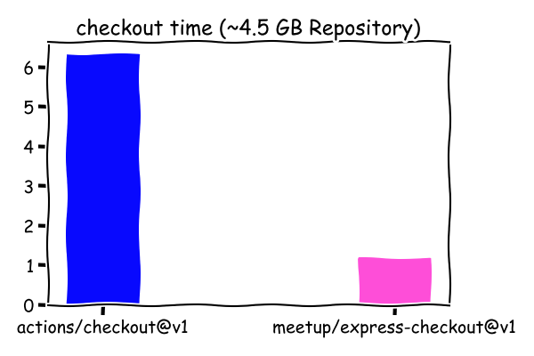

| > **⚠️ Note:** GitHub [actions/checkout@v2](https://github.com/actions/checkout) has made big leaps and is now comparably fast compared to meetup/express-checkout. Use that instead.

<div align="center">
  💳 :octocat:
</div>
<h1 align="center">
  express checkout
</h1>

<p align="center">
   A GitHub Actions checkout action that's fast for git repositories of all shapes and sizes
</p>

<div align="center">
  
</div>

<div align="center">
  <a href="https://github.com/meetup/express-checkout/actions">
		
	</a>
  &nbsp;
  <a href='https://coveralls.io/github/meetup/express-checkout?branch=master'>
    
  </a>
</div>

<br />

> **⚠️ Note:** To use this action, you must have access to the [GitHub Actions](https://github.com/features/actions) feature. GitHub Actions are currently only available in public beta. You can [apply for the GitHub Actions beta here](https://github.com/features/actions/signup/).

## 🏃‍♀️ Fast you say?

Unfortunately, not all code repositories are small. For organizations that structure code within mono repositories, you can find yourself in situations where simply cloning your repository can become an obstacle for fast continuous integration. In a stateless and serverless continuous integration system like GitHub Actions you want this to be as fast as possible. This is the goal of this GitHub action.

We quick realized this with some of our most important repositories when trialing GitHub actions, the default checkout action was less than ideal.

```yaml
name: CI
jobs:
  test:
    steps:
      - uses: actions/checkout@v1
        with:
          fetch-depth: 1
```

Would take upwards of **6 to 7 minutes** _before_ CI could do anything useful. With express-checkout, we've got that down to **1**.

## 🤸 usage


In a workflow for example, say `.github/workflows/ci.yml` add the following.

```yaml
name: CI
jobs:
  test:
    runs-on: ubuntu-latest
    steps:
      - name: Checkout
        uses: meetup/express-checkout@master
        env:
          GITHUB_TOKEN: ${{ secrets.GITHUB_TOKEN }}
      - name: Test
        run: echo ⭐ ⭐ ⭐
```

## ⛏️Digging deeper

> **⚠️ Note:** For private repositories you will want to create a new secret to store a personal access token with `repo` permissions. GitHub actions default `GITHUB_TOKEN` secret does not have the permission to clone your private repository.

This action will attempt to checkout a specific commit within a branch that triggered the action. To do so, it may need to "deepen" the shallow checkout. This will by default deepen the checkout to **100**. However, you can provide a custom `max_depth` to limit the amount of depth this action will dig for your commit.

```yaml
name: CI
jobs:
  test:
    runs-on: ubuntu-latest
    steps:
      - name: Checkout
        uses: meetup/express-checkout@master
        with:
          max_depth: 5
        env:
          GITHUB_TOKEN: ${{ secrets.CLONE_TOKEN }}
      - name: Test
        run: echo ⭐ ⭐ ⭐
```

## 🗣️shoutouts

This action was inspired in part by [@zoispag's](https://github.com/zoispag) comments [here](https://github.com/actions/checkout/issues/22) as well as the [Concourse CI Git Resource](https://github.com/concourse/git-resource).

Meetup Inc 2019
